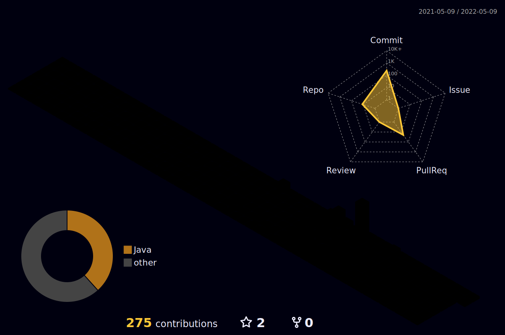

<h1 align="center">
  
  𝐇𝐞𝐥𝐥𝐨, &lt;𝚌𝚘𝚍𝚎𝚛𝚜/&gt;!
  
</h1>
<h3 align="center">I'm a passionate frontend Java developer from India</h3>

 
 

- 🤝 I’m looking for help with **Java related projects**
- 🤖 Open Source Enthusiast
- 🌱 𝙸’𝚖 𝚌𝚞𝚛𝚛𝚎𝚗𝚝𝚕𝚢 𝚕𝚎𝚊𝚛𝚗𝚒𝚗𝚐 **𝙳𝚎𝚟𝙾𝚙𝚜**
- 😄 𝙿𝚛𝚘𝚗𝚘𝚞𝚗𝚜 : **𝙷𝚎/𝙷𝚒𝚖/𝙷𝚒𝚜**
- ⚡ 𝙵𝚞𝚗 𝚏𝚊𝚌𝚝 : **When you try to wash a spoon and it wash you back <<<😪**

- 💬 Ask me about **[Data Structures & Algorithms](https://github.com/SensationalShubham/Data-Structures-and-Algo.-in-java)**

- 📫 How to reach me **bansal4995@gmail.com**

 
 

  
  •
  •  
  •
  

#

  
  
  

#

 

<h2>
𝙻𝙰𝙽𝙶𝚄𝙰𝙶𝙴𝚂 & 𝚃𝙾𝙾𝙻𝚂 :  
</h2>

 
 
<code></code>
<code></code>
<code></code>
<code></code>
<code></code>
<code></code>
<!-- <code></code> -->

<h2>
  Hey, I'm here     
    
</h2>

 
 

#

  <g-emoji class="g-emoji" alias="chart_with_upwards_trend" fallback-src="https://github.githubassets.com/images/icons/emoji/unicode/1f4c8.png">📈</g-emoji>
  <strong>𝙶𝚒𝚝𝚑𝚞𝚋 𝚂𝚝𝚊𝚝𝚜 : </strong>

 

    
    

 

 
